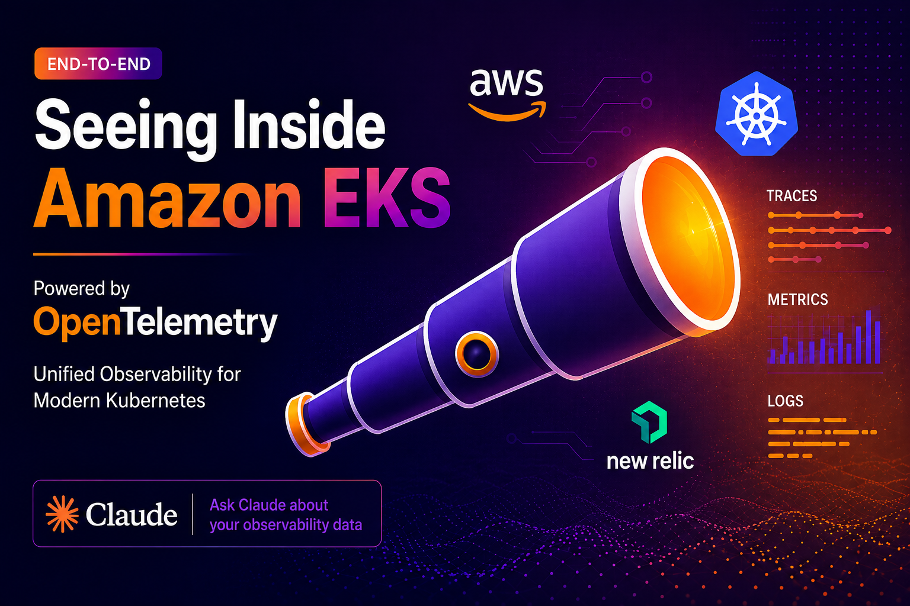
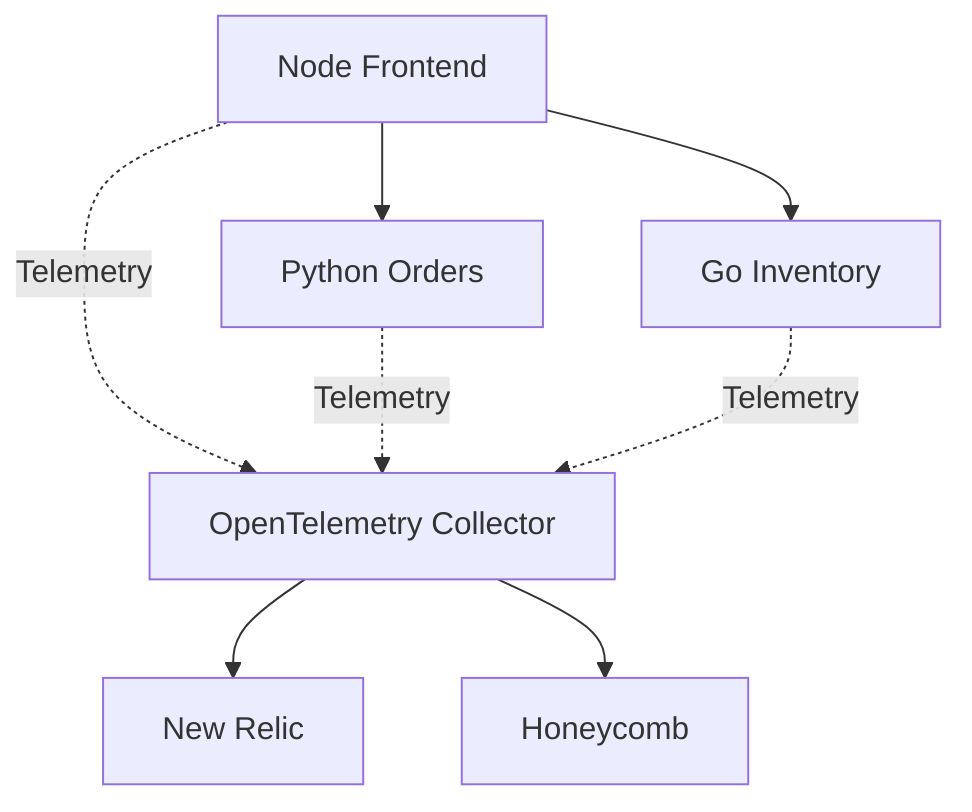
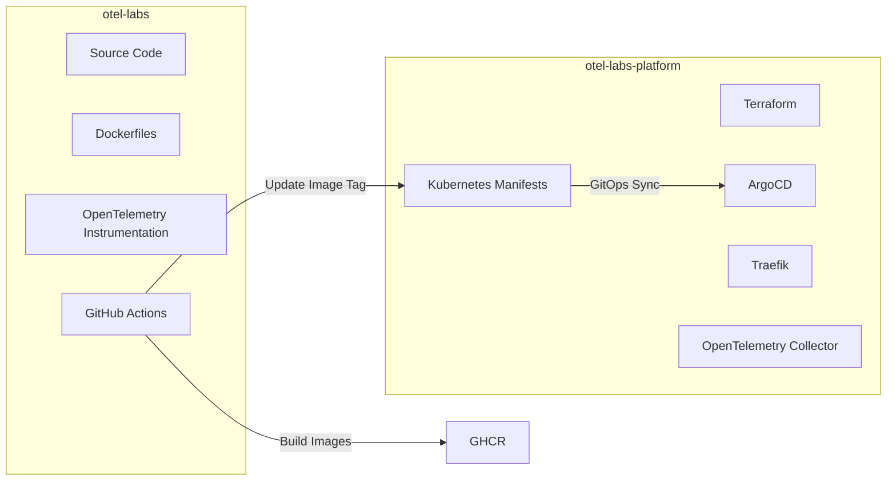

# OTel Labs – OpenTelemetry on EKS: End-to-End Observability

> Companion platform repository:
>
> https://github.com/sagarkpanda/otel-labs-platform



## Overview

OTel Labs is a hands-on observability project built to learn OpenTelemetry across multiple programming languages, deployment environments, and observability backends.

The project consists of three microservices:

* Node Frontend
* Python Orders Service
* Go Inventory Service

Each service is instrumented using OpenTelemetry SDKs and exports telemetry to a centralized OpenTelemetry Collector.

The collector processes and exports traces, metrics, and logs to multiple observability backends.

Currently tested with:

* New Relic
* Honeycomb

The applications are deployed locally using Docker Compose and on Kubernetes using Amazon EKS and ArgoCD.


## Architecture


## Features

### Distributed Tracing

Track requests as they flow through multiple services.

```text
Node Frontend
      ↓
Python Orders
      ↓
Go Inventory
```

### Metrics

Collect application and runtime metrics including:

* Request counts
* Request duration
* Custom business metrics
* Runtime metrics


### Logs

Export structured logs through OpenTelemetry.

### Vendor Neutral Instrumentation

Applications use standard OpenTelemetry SDKs and remain independent of any observability vendor.

Switching backends only requires collector configuration changes.

Supported backends include:

* New Relic
* Honeycomb
* Datadog
* Grafana Cloud
* Elastic
* Any OTLP-compatible platform

## Tech Stack

### Applications

* Node.js
* Python
* Go

### Observability

* OpenTelemetry SDKs
* OpenTelemetry Collector

### Containerization

* Docker
* Docker Compose

### CI/CD

* GitHub Actions
* GitHub Container Registry (GHCR)

### GitOps

* ArgoCD

### Container Orchestration

* Amazon EKS
* Traefik Ingress Controller

### Observability Backends

* New Relic
* Honeycomb

## Local Development

Start the entire stack:

```bash
docker compose up --build
```

### Services

| Service                 | Port        |
| ----------------------- | ----------- |
| Node Frontend           | 3000        |
| Python Orders           | 8000        |
| Go Inventory            | 8080        |

## Environment Variables

Create a `.env` file:

```env
NR_KEY=<your_new_relic_license_key>
HC_KEY=<your_honeycomb_api_key>

GHCR_OWNER=<your_github_username>
IMAGE_TAG=local
```

The OpenTelemetry Collector reads these values and exports telemetry to the configured observability backends.

Do not commit `.env` files to source control.

## Relationship with otel-labs-platform

This repository contains:

* Application source code
* OpenTelemetry instrumentation
* Docker images
* GitHub Actions workflows

The companion platform repository contains:

* Terraform
* Amazon EKS
* ArgoCD
* Traefik
* OpenTelemetry Collector
* Kubernetes manifests

Deployment flow:



## GitHub Actions

A GitHub Actions workflow automatically:

1. Builds application images
2. Pushes images to GitHub Container Registry (GHCR)
3. Updates image tags inside the `otel-labs-platform` repository
4. ArgoCD sync updates deployment

Resulting images:

```text
ghcr.io/<github-user>/node-frontend
ghcr.io/<github-user>/python-orders
ghcr.io/<github-user>/go-inventory
```

## Project Overview

* OpenTelemetry
* Distributed tracing
* Metrics and logging
* OpenTelemetry Collector configuration
* Multi-language instrumentation
* Docker-based deployments
* GitHub Actions CI/CD
* GitOps workflows
* Amazon EKS
* Kubernetes observability
* Multi-backend telemetry pipelines

## Project Status

### Phase 1 – Completed

* Node.js instrumentation
* Python instrumentation
* Go instrumentation
* OpenTelemetry Collector
* New Relic integration
* Docker Compose setup

### Phase 2 – Completed

* GitHub Container Registry (GHCR)
* GitHub Actions CI/CD
* Kubernetes manifests
* Kustomize image updates

### Phase 3 – Completed

* Amazon EKS deployment
* ArgoCD GitOps workflow
* Automated image promotion
* Traefik ingress
* OpenTelemetry on Kubernetes

### Phase 4 – Completed

* kubeletstats receiver
* k8s_cluster receiver
* kube-state-metrics
* Kubernetes telemetry
* New Relic integration
* Honeycomb integration

### Phase 5 – TODO

* ApplicationSets
* Multi-cluster GitOps
* Vault + External Secrets
* Prometheus + Grafana stack
* Loki / Tempo
* Advanced OpenTelemetry pipelines
* Base Overlay Setup

## Disclaimer

This repository is intended as a demo project for exploring OpenTelemetry, observability, Kubernetes, GitOps, and cloud-native platform engineering.